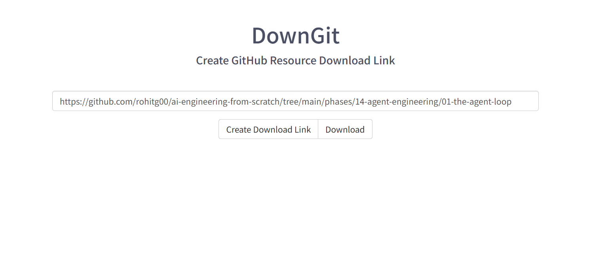

### DownGit
- **网址**: [https://minhaskamal.github.io/DownGit/#/home](https://minhaskamal.github.io/DownGit/#/home)
- **Github网址** https://github.com/MinhasKamal/DownGit
- **功能**: 允许用户直接从 GitHub 仓库下载单个文件或文件夹，无需克隆整个仓库。特别适合只需要仓库中部分代码的场景，节省时间和存储空间。

评语：DownGit是一个用于单独下载github中文件或文件夹中内容的的项目只需要将链接直接放入即可download，简单好用。不过网站该下载对网络环境有些要求。也可采用git clone拉取下来本地使用

